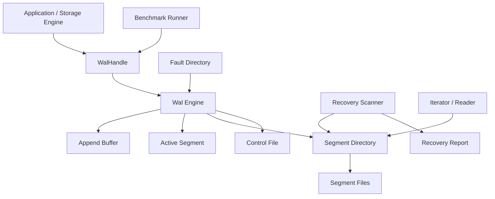

# A-WAL

A crash-safe, segmented, append-only write-ahead log in Rust.

A-WAL is a focused WAL implementation for storage engines that need a trustworthy byte log: append records in order, make durability explicit, recover after crashes, repair torn tails, replay history, and prune old sealed segments safely.

The implementation is deliberately low-level. It stores typed opaque records and gives callers precise control over append, flush, sync, iteration, recovery, and retention. Higher layers decide what record payloads mean; the WAL makes sure those records are written, synced, recovered, and replayed correctly.

This repository currently implements:

- frozen segment and record formats,
- monotonic LSN allocation,
- append and batch append,
- explicit `flush()` and `sync()` durability boundaries,
- segment rollover with segment seal records,
- startup recovery scan,
- maximal-valid-prefix recovery,
- corrupt tail truncation,
- corruption detection in sealed history,
- sequential replay,
- point lookup by record LSN,
- clean shutdown witness and fast reopen path,
- whole-segment retention pruning,
- retention pins for long-lived readers,
- concurrent access through `WalHandle`,
- tail-following iteration,
- deterministic crash/fault injection,
- metrics and recovery reporting,
- an end-to-end benchmark runner.

---

## Why This WAL Exists

A write-ahead log has one job at its core:

> accept records in order, put them on disk safely, and after a crash reconstruct the longest prefix that can be trusted.

That promise is useful anywhere ordered durable history matters:

- storage engines,
- embedded storage systems,
- queues,
- brokers,
- metadata journals,
- replicated state machines,
- recovery logs,
- event-sourced systems.

The goal of this project is to make the byte log itself boring, explicit, inspectable, and hard to accidentally corrupt.

The main design rules are:

- the on-disk format is a contract,
- LSNs are logical byte offsets,
- segment headers do not consume logical LSN space,
- record headers and payloads are checksummed,
- recovery keeps the maximal valid prefix,
- invalid newest-tail bytes may be truncated,
- sealed history is never silently repaired,
- durability states are explicit,
- callers own record semantics while the WAL owns storage correctness.

---

## Current Status

This is a complete standalone WAL implementation with a narrow, explicit contract.

| Area | Status |
|---|---|
| Segment format | Implemented |
| Record format | Implemented |
| CRC32C checksums | Implemented |
| LSN allocation | Implemented |
| Append | Implemented |
| Batch append | Implemented |
| Reservation API | Implemented on low-level `Wal` |
| Flush/sync boundaries | Implemented |
| Segment rollover | Implemented |
| Segment seal records | Implemented |
| Recovery scan | Implemented |
| Tail truncation | Implemented |
| Sealed-history corruption detection | Implemented |
| Sequential iteration | Implemented |
| Point lookup by LSN | Implemented |
| Clean shutdown fast path | Implemented |
| Control file | Implemented |
| Retention pruning | Implemented |
| Bulk retention pruning optimization | Implemented |
| Retention pins | Implemented |
| Concurrent wrapper | Implemented |
| Tail-following iterator | Implemented |
| Fault injection | Implemented |
| Metrics | Implemented |
| Recovery observer callbacks | Implemented |
| Benchmark runner | Implemented |
| Compression read support | Implemented |
| Compression write path | Format hooks present, writer currently stores user payloads uncompressed |

---

## Architecture



The implementation is split into several layers.

### 1. Public types

The basic public model lives in:

- [`src/types.rs`](src/types.rs)
- [`src/lsn.rs`](src/lsn.rs)
- [`src/config.rs`](src/config.rs)
- [`src/error.rs`](src/error.rs)

These define:

- `Lsn`,
- `RecordType`,
- internal record type constants,
- `WalIdentity`,
- `WalConfig`,
- `SyncPolicy`,
- `CompressionPolicy`,
- `WalError`.

### 2. Format layer

The format layer lives in [`src/format`](src/format).

It owns:

- manual little-endian encoding,
- segment headers,
- record headers,
- CRC32C checksum coverage,
- decompression helpers,
- strict validation.

There is no serde format here. The byte layout is hand-written because WAL bytes are a long-term compatibility contract.

### 3. IO layer

The IO layer lives in [`src/io`](src/io).

It owns:

- append buffers,
- filesystem-backed segment files,
- segment directory operations,
- control file publication,
- storage write unit detection,
- deterministic fault injection.

The important abstractions are:

- `SegmentFile`,
- `SegmentDirectory`,
- `FsSegmentFile`,
- `FsSegmentDirectory`,
- `FaultDirectory`.

### 4. WAL engine

The core engine lives in [`src/wal/engine.rs`](src/wal/engine.rs).

It owns:

- active segment state,
- append and batch append,
- reservation commit/abort,
- buffer draining,
- flush and sync,
- rollover,
- segment seals,
- retention state,
- clean shutdown,
- metrics,
- direct read and iteration entry points.

### 5. Concurrent handle

The higher-level concurrent API lives in [`src/wal/handle.rs`](src/wal/handle.rs).

`WalHandle` wraps the engine in synchronization primitives and provides:

- cloneable concurrent handles,
- append serialization,
- read snapshots that do not hold the WAL mutex during file IO,
- `sync_through(lsn)` coordination,
- tail-following iteration,
- retention pin integration.

For most application code, `WalHandle` is the API to use.

### 6. Recovery

Recovery lives in:

- [`src/wal/recovery.rs`](src/wal/recovery.rs)
- [`src/wal/report.rs`](src/wal/report.rs)
- [`src/wal/recovery_observer.rs`](src/wal/recovery_observer.rs)
- [`src/wal/shutdown.rs`](src/wal/shutdown.rs)

It owns:

- segment discovery,
- identity validation,
- header validation,
- record validation,
- checkpoint record detection,
- clean shutdown fast path,
- newest-tail repair,
- sealed-history corruption handling,
- recovery reporting,
- optional observer callbacks.

### 7. Benchmarks

The benchmark runner lives in [`src/bin/wal_bench.rs`](src/bin/wal_bench.rs).

It is not part of the production API. It is a quick end-to-end tool for measuring the current implementation across append, sync, batching, rollover, recovery, replay, point reads, retention, tail-following, corrupt-tail repair, and clean shutdown reopen.

---

## Repository Layout

```text
src/
  lib.rs
  main.rs
  config.rs
  error.rs
  lsn.rs
  types.rs

  bin/
    wal_bench.rs

  format/
    codec.rs
    compression.rs
    record_header.rs
    segment_header.rs

  io/
    buffer.rs
    control_file.rs
    directory.rs
    fault.rs
    fs.rs
    segment_file.rs

  wal/
    engine.rs
    handle.rs
    iterator.rs
    metrics.rs
    recovery.rs
    recovery_observer.rs
    report.rs
    retention.rs
    retention_pin.rs
    segment.rs
    shutdown.rs
    sync_coordinator.rs

tests/
  append.rs
  append_batch.rs
  config.rs
  crash_flush_sync.rs
  format.rs
  handle.rs
  iterator.rs
  max_wal_size.rs
  recovery_mid_segment.rs
  recovery_observer.rs
  recovery_tail.rs
  reservation.rs
  retention.rs
  retention_pins.rs
  rollover.rs
  shutdown.rs

images/
  Broker Cluster Coordination-2026-04-14-104947.png
  Broker Cluster Coordination-2026-04-14-110032.png
```

Architecture diagram:


Simplified diagram:


---

## Core Concepts

### WAL identity

Every WAL belongs to a specific identity:

```rust
pub struct WalIdentity {
    pub system_id: u64,
    pub wal_incarnation: u64,
    pub timeline_id: u64,
}
```

The identity is written into every segment header and the control file.

This protects against opening the wrong directory for the wrong system. If a segment's identity does not match the configured identity, open/recovery fails with an identity mismatch.

The fields are meant to map naturally to storage deployments:

- `system_id`: identifies the cluster, service, or storage system,
- `wal_incarnation`: changes when the WAL universe is recreated,
- `timeline_id`: identifies the current timeline or history branch.

### LSN

`Lsn` is a logical byte offset in the unified WAL stream:

```rust
pub struct Lsn(pub u64);
```

Rules:

- record headers consume LSN space,
- record payloads consume LSN space,
- optional record padding consumes LSN space,
- segment headers do **not** consume LSN space,
- `Lsn::ZERO` is the first possible record header,
- `next_lsn` is the byte offset where the next record header will be written,
- `read_at(lsn)` expects a record-header LSN,
- `iter_from(lsn)` expects either a valid record-header LSN or the current end LSN.

Example:

```text
segment header: physical bytes only, no LSN space
record 1 header at LSN 0
record 1 payload
record 2 header at LSN record_1_total_len
record 2 payload
```

### Record types

`RecordType` wraps a `u16`.

Internal WAL record types are below `USER_MIN`.

```rust
pub mod record_types {
    pub const USER_MIN: u16 = 1024;

    pub const SEGMENT_MARKER: RecordType = RecordType::new(1);
    pub const BEGIN_CHECKPOINT: RecordType = RecordType::new(2);
    pub const END_CHECKPOINT: RecordType = RecordType::new(3);
    pub const CHECKPOINT_CHUNK: RecordType = RecordType::new(4);
    pub const SEGMENT_SEAL: RecordType = RecordType::new(5);
    pub const SHUTDOWN: RecordType = RecordType::new(6);
}
```

Higher-level users should use record types starting at `record_types::USER_MIN`.

Example user record assignments:

- `USER_MIN + 0`: metadata update,
- `USER_MIN + 1`: state transition,
- `USER_MIN + 2`: page or block update,
- `USER_MIN + 3`: checkpoint marker,
- `USER_MIN + 4`: application event.

A-WAL does not assign those meanings. It stores and returns opaque typed records so callers can build their own protocol on top.

### Durability states

A-WAL makes durability explicit.

| Operation | Meaning |
|---|---|
| `append()` | Record accepted into the WAL write path and assigned an LSN |
| `flush()` | Buffered bytes are pushed into the file/OS path |
| `sync()` | WAL bytes are durable according to the segment file's sync implementation |
| `sync_through(lsn)` | Concurrent handle syncs until at least the requested LSN is durable |
| `shutdown()` | Writes a shutdown witness, syncs it, and publishes a clean shutdown control file |

This distinction matters. A flushed record is not necessarily durable after a crash. The fault-injection tests explicitly model this.

### Segments

The WAL is split into sortable segment files:

```text
{segment_id:020}_{base_lsn:020}.wal
```

Example:

```text
00000000000000000001_00000000000000000000.wal
00000000000000000002_00000000000000065536.wal
```

The filename and segment header must agree on:

- segment id,
- base LSN.

If they disagree, the WAL treats it as corruption/operator error.

Segments are not preallocated. File length means actual written bytes.

### Segment seal

When rollover happens, A-WAL writes an internal `SEGMENT_SEAL` record before creating the next segment.

The seal payload contains:

```rust
pub struct SegmentSealPayload {
    pub segment_id: SegmentId,
    pub record_count: u64,
    pub logical_bytes: u64,
}
```

This gives recovery a clear marker that the segment was deliberately closed. Sealed segment corruption is treated much more strictly than newest-tail corruption.

### Control file

The control file is named:

```text
wal.control
```

It stores:

- WAL identity,
- last checkpoint LSN if known,
- checkpoint number,
- clean shutdown flag,
- checksum.

The control file is published through a temporary file, file sync, rename, and directory sync. It is used mainly for the clean shutdown fast path and checkpoint pointer validation.

---

## On-Disk Format

The format is intentionally manual and fixed.

There is no serde, no bincode, no JSON, and no platform-dependent layout.

### Segment file layout

```text
+-----------------------------+
| segment header              |
+-----------------------------+
| record 1 header             |
+-----------------------------+
| record 1 payload            |
+-----------------------------+
| optional padding            |
+-----------------------------+
| record 2 header             |
+-----------------------------+
| record 2 payload            |
+-----------------------------+
| optional padding            |
+-----------------------------+
| ...                         |
+-----------------------------+
```

### Segment header

Segment headers are 68 bytes.

```rust
pub struct SegmentHeader {
    pub magic: u32,
    pub version: u16,
    pub header_len: u16,
    pub system_id: u64,
    pub wal_incarnation: u64,
    pub timeline_id: u64,
    pub segment_id: SegmentId,
    pub base_lsn: Lsn,
    pub checksum_algorithm: u8,
    pub compression_algorithm: u8,
    pub header_checksum: u32,
    pub reserved: [u8; 14],
}
```

Validation checks:

- magic is correct,
- version is supported,
- header length is exact,
- checksum algorithm is supported,
- compression algorithm is supported,
- reserved bytes are zero,
- checksum matches,
- identity matches the configured WAL identity.

### Record header

Record headers are 32 bytes.

```rust
pub struct RecordHeader {
    pub magic: u32,
    pub version: u16,
    pub record_type: RecordType,
    pub header_len: u16,
    pub flags: u16,
    pub payload_len: u32,
    pub lsn: Lsn,
    pub checksum: u32,
    pub reserved: u32,
}
```

Validation checks:

- magic is correct,
- version is supported,
- header length is exact,
- only known flags are set,
- reserved bytes are zero,
- payload length matches,
- checksum over header plus payload matches,
- record LSN is exactly the expected next LSN during recovery.

### Checksums

The implementation uses CRC32C.

Segment header checksum covers the encoded segment header with the checksum field zeroed.

Record checksum covers:

- encoded record header with the checksum field zeroed,
- record payload.

This means changing either the header or payload is detected.

### Compression

The format has compression identifiers:

```rust
pub mod compression_algorithms {
    pub const NONE: u8 = 0;
    pub const LZ4: u8 = 1;
    pub const ZSTD: u8 = 2;
}
```

Reader-side decompression exists for LZ4 and ZSTD records.

Important implementation note: the current writer path stores user payloads uncompressed. `CompressionPolicy` and segment header fields exist so the format can represent compression, and the iterator/read path can decode compressed records that are present on disk.

---

## Configuration

The main config type is `WalConfig`.

```rust
pub struct WalConfig {
    pub dir: PathBuf,
    pub identity: WalIdentity,
    pub target_segment_size: u64,
    pub max_record_size: u32,
    pub storage_write_unit: u32,
    pub write_buffer_size: usize,
    pub write_buffer_count: usize,
    pub format_version: u16,
    pub sync_policy: SyncPolicy,
    pub truncate_tail: bool,
    pub read_only: bool,
    pub record_alignment: u32,
    pub max_recycled_segments: usize,
    pub compression_policy: CompressionPolicy,
    pub max_wal_size: Option<u64>,
}
```

Default values:

| Field | Default |
|---|---:|
| `target_segment_size` | 64 MiB |
| `max_record_size` | 1 MiB |
| `storage_write_unit` | 4096 |
| `write_buffer_size` | 4 MiB |
| `write_buffer_count` | 2 |
| `format_version` | 1 |
| `sync_policy` | `OnExplicitSync` |
| `truncate_tail` | true |
| `read_only` | false |
| `record_alignment` | 0 |
| `max_recycled_segments` | 8 |
| `compression_policy` | `None` |
| `max_wal_size` | none |

Validation enforces:

- supported format version,
- storage write unit at least 512,
- storage write unit is a power of two,
- write buffer is non-zero,
- write buffer count is non-zero,
- write buffer size is aligned to storage write unit,
- record alignment is one of `0`, `512`, or `4096`,
- segment size can hold at least one maximum record plus a segment seal,
- write buffer can hold one maximum physical record,
- max WAL size is non-zero when present.

### Sync policies

```rust
pub enum SyncPolicy {
    Always,
    OnExplicitSync,
    GroupCommit {
        max_delay: Duration,
        max_batch: usize,
    },
    Never,
}
```

Current behavior:

- `Always`: append and batch append call `sync()` before returning.
- `OnExplicitSync`: caller decides when to call `sync()`.
- `GroupCommit`: config shape exists, but the current practical group-sync API is `WalHandle::sync_through(lsn)`.
- `Never`: no automatic sync from append path. Useful only when durability is intentionally disabled or externally controlled.

For durable commit-style workloads, normal usage should be either explicit sync at commit boundaries or group commit through `WalHandle::sync_through`.

### Other important config fields

`truncate_tail`

- `true`: recovery may truncate invalid bytes from the newest segment tail.
- `false`: recovery reports tail corruption instead of repairing it.

`read_only`

- rejects append, flush, sync, shutdown, retention mutation, and retention pin acquisition,
- still allows inspection,
- refuses corrupt-tail repair because truncation would mutate the directory.

`record_alignment`

- may be `0`, `512`, or `4096`,
- adds zero padding after records so the next record header is aligned,
- padding consumes logical LSN space because LSN is defined over physical record bytes after the segment header.

`max_wal_size`

- caps admitted WAL bytes,
- append and batch append preflight projected growth,
- pruning can free space so later appends can proceed.

`write_buffer_count`

- validated as part of the config shape,
- reserved for the later production writer architecture,
- the current writer uses the single append buffer represented by `write_buffer_size`.

`max_recycled_segments`

- reserved for segment recycling policy,
- retention currently removes old segments rather than maintaining a recycled segment pool.

---

## Error Model

Errors are represented by `WalError`.

Important categories:

| Error | Meaning |
|---|---|
| `InvalidConfig` | Config cannot safely run |
| `UnsupportedVersion` | Segment/record/control version is not supported |
| `BadMagic` | Header does not look like this WAL format |
| `IdentityMismatch` | Segment/control belongs to another WAL identity |
| `BadSegmentHeader` | Segment/control header failed structural validation |
| `BadRecordHeader` | Record header failed structural validation |
| `UnsupportedRecordFlags` | Unknown record flag bits are set |
| `PayloadTooLarge` | Payload exceeds `max_record_size` |
| `UnsupportedChecksumAlgorithm` | Segment asks for unknown checksum algorithm |
| `UnsupportedCompressionAlgorithm` | Segment asks for unknown compression algorithm |
| `ChecksumMismatch` | Header/payload bytes do not match checksum |
| `ShortRead` | File ended before expected bytes were read |
| `FatalIo` | Mutating IO failed and WAL entered sticky fatal state |
| `BrokenDurabilityContract` | Internal durability invariant was violated |
| `NonMonotonicLsn` | Recovery found an unexpected record LSN |
| `LsnPruned` | Caller requested history already removed by retention |
| `LsnOutOfRange` | Caller requested an LSN outside readable WAL range |
| `ReadOnlyViolation` | Mutation attempted in read-only mode |
| `SegmentOrderingViolation` | Segment sequence is not valid |
| `FilenameHeaderMismatch` | Filename and segment header disagree |
| `ReadOnlyTailCorruption` | Read-only recovery found truncatable tail corruption |
| `CorruptionInSealedSegment` | Older sealed history is corrupt |
| `WalSizeLimitExceeded` | Append would exceed configured WAL size limit |
| `ShutdownInProgress` | Operation attempted after shutdown began |
| `DecompressionError` | Compressed payload could not be decoded |
| `ReservationOverflow` | Arithmetic/reservation overflow protection fired |

The sticky fatal IO behavior matters. If a mutating filesystem operation fails in a way that could leave the in-memory writer state ahead of durable state, the WAL records a safe durable LSN and rejects further operations until reopen.

That is conservative, and it is the right default for a storage component.

---

## Public API

There are two main API surfaces:

- `Wal`: low-level, single-owner engine,
- `WalHandle`: cloneable concurrent wrapper.

Most application code should use `WalHandle`.

### Opening a WAL

```rust
use std::{fs, path::PathBuf};

use wal::{
    config::WalConfig,
    io::directory::FsSegmentDirectory,
    types::{WalIdentity, RecordType, record_types},
    wal::WalHandle,
};

fn main() -> Result<(), Box<dyn std::error::Error>> {
    let dir = PathBuf::from("./wal-data");
    fs::create_dir_all(&dir)?;

    let config = WalConfig {
        dir: dir.clone(),
        identity: WalIdentity::new(11, 1, 1),
        ..WalConfig::default()
    };

    let directory = FsSegmentDirectory::new(dir);
    let (wal, recovery) = WalHandle::open(directory, config, ())?;

    println!("recovered {} records", recovery.records_scanned);

    let lsn = wal.append(
        RecordType::new(record_types::USER_MIN),
        b"hello wal",
    )?;

    wal.sync()?;

    let record = wal.read_at(lsn)?;
    assert_eq!(record.payload, b"hello wal");

    Ok(())
}
```

The third argument is currently a placeholder checksummer type. The implementation uses the format-level CRC32C path directly.

### Append

```rust
let lsn = wal.append(record_type, payload)?;
```

Append:

- validates record size,
- prepares payload,
- creates the first segment if needed,
- assigns a monotonic LSN,
- encodes the record,
- writes to the append buffer,
- drains full storage-write-unit chunks to the file,
- rolls over if the active segment cannot fit the record plus the reserved segment seal,
- returns the record-header LSN.

### Batch append

```rust
let records = [
    (RecordType::new(record_types::USER_MIN), b"one".as_slice()),
    (RecordType::new(record_types::USER_MIN + 1), b"two".as_slice()),
];

let lsns = wal.append_batch(&records)?;
wal.sync()?;
```

Batch append:

- validates the full batch before mutation where possible,
- assigns contiguous LSNs,
- amortizes sync if `SyncPolicy::Always` is enabled,
- records batch metrics.

Batch append is the better shape for commit-style durability and log ingestion.

### Flush

```rust
wal.flush()?;
```

Flush drains all buffered bytes into the file path and flushes the file object.

It does **not** advance the durable LSN.

### Sync

```rust
wal.sync()?;
```

Sync:

- drains all buffered bytes,
- calls file sync on the active segment,
- advances `durable_lsn`,
- records sync metrics.

### Sync through an LSN

```rust
wal.sync_through(target_lsn)?;
```

`sync_through` is available on `WalHandle`.

It coordinates concurrent sync waiters so multiple threads can request durability through different LSNs while one in-flight sync can satisfy multiple waiters.

Current caveat: `append()` returns the start LSN of the record. To call `sync_through` precisely, the caller must know the record's physical length and pass the end LSN. For simple code, `wal.sync()` is easier.

### Read at LSN

```rust
let record = wal.read_at(lsn)?;
```

Point lookup:

- snapshots segment metadata,
- finds the segment containing the LSN,
- validates that the LSN points to a record header,
- reads the record,
- verifies checksum,
- decompresses if needed,
- returns `WalRecord`.

```rust
pub struct WalRecord {
    pub lsn: Lsn,
    pub record_type: RecordType,
    pub payload: Vec<u8>,
    pub total_len: u32,
}
```

### Sequential iteration

```rust
let mut iter = wal.iter_from(Lsn::ZERO)?;

while let Some(record) = iter.next()? {
    println!("record at {}", record.lsn.as_u64());
}
```

Iteration is the standard recovery/replay path: open the WAL, choose a starting LSN, and replay records from there.

### Tail-following iteration

```rust
let mut tail = wal.tail_from(Lsn::ZERO)?;

if let Some(record) = tail.next_blocking(std::time::Duration::from_secs(1))? {
    println!("observed record at {}", record.lsn.as_u64());
}
```

Tail-following is useful for:

- live consumers,
- replication prototypes,
- debugging tools,
- streaming WAL inspection.

Tail iterators acquire retention pins so their needed history is not pruned while they are active.

### Shutdown

```rust
wal.shutdown()?;
```

Shutdown:

- flushes and syncs existing data,
- writes an internal `SHUTDOWN` record,
- syncs again,
- publishes a clean shutdown control file,
- rejects later appends on that handle.

On next open, the WAL can use a clean shutdown fast path instead of scanning the full log.

### Metrics

```rust
let metrics = wal.metrics();
```

Metrics include:

- records appended,
- batch append count,
- bytes appended,
- bytes synced,
- sync call count,
- total sync duration,
- last sync duration,
- segment rollover count,
- recycled segment count,
- recovery repairs,
- group commit batches,
- group commit waiters,
- last recovery duration,
- clean shutdown count,
- current WAL size,
- active retention pin count,
- compressed record count,
- compression bytes saved,
- tailing iterator count.

### Retention

```rust
wal.set_min_retention_lsn(checkpoint_lsn)?;
let removed = wal.truncate_segments_before(checkpoint_lsn)?;
```

Retention only removes whole sealed segments. It does not punch holes inside a segment.

The current implementation:

- computes an effective prune floor,
- respects retention pins,
- never removes the active segment,
- validates segment identity before pruning,
- removes whole prefix segments,
- updates `first_lsn`,
- updates WAL size metrics.

The retention pruning path was optimized after benchmarking. The first version removed thousands of segments slowly because it repeatedly listed the directory and synced the directory per file. The current filesystem implementation does bulk removal: list once, unlink all requested segments, then sync the directory once.

### Retention pins

```rust
let pin = wal.acquire_retention_pin("reader", start_lsn)?;

// WAL history before start_lsn is protected while pin is alive.

drop(pin);
```

Retention pins protect readers and tail-followers from losing the segment range they still need.

### Reservation API

The low-level `Wal` engine has a reservation API:

```rust
let mut reservation = wal.reserve(count, total_payload_bytes)?;
reservation.append(record_type, payload)?;
let lsns = reservation.commit()?;
```

Reservations are useful when a caller wants to stage a known group of records and either publish them together or abort without leaving holes.

This API is currently exposed on the low-level engine, not the high-level `WalHandle`.

---

## Recovery Model

Recovery is one of the most important parts of this repository.

The rule is:

> reconstruct the maximal valid prefix of the WAL.

### Recovery scan

On open, the WAL:

1. validates config,
2. loads the control file if present,
3. lists segment files,
4. sorts by base LSN and segment id,
5. validates segment filenames against segment headers,
6. validates WAL identity,
7. scans records in LSN order,
8. verifies headers and checksums,
9. detects checkpoints,
10. detects segment seals,
11. finds the valid end of the WAL,
12. truncates only the newest invalid tail when allowed,
13. reconstructs active segment state,
14. returns a `RecoveryReport`.

### Recovery report

```rust
pub struct RecoveryReport {
    pub segments_scanned: usize,
    pub records_scanned: u64,
    pub corrupt_records_found: u64,
    pub first_lsn: Option<Lsn>,
    pub last_valid_lsn: Option<Lsn>,
    pub next_lsn: Lsn,
    pub checkpoint_lsn: Option<Lsn>,
    pub truncated_bytes: u64,
    pub sealed_segments: usize,
    pub segments_prunable: usize,
    pub recovery_duration: Duration,
    pub clean_shutdown: bool,
    pub recovery_skipped: bool,
}
```

This makes startup behavior observable instead of mysterious.

### Tail corruption

If corruption is found in the newest segment tail and `truncate_tail = true`, recovery truncates the invalid suffix.

This handles cases like:

- partial record header,
- partial payload,
- torn write,
- checksum mismatch in the newest record,
- flushed but unsynced suffix after crash.

### Sealed segment corruption

If corruption is found in an older sealed segment, recovery fails hard.

That is intentional. Older sealed history is supposed to be immutable. Silently repairing it would hide real data loss.

### Read-only recovery

If `read_only = true`, recovery refuses to truncate a corrupt tail because truncation is a mutation.

Read-only mode is useful for inspection and safety checks.

### Clean shutdown fast path

When `shutdown()` succeeds, A-WAL writes a shutdown witness record and publishes `wal.control` with `clean_shutdown = true`.

On the next open, the WAL can verify the clean tail and avoid a full scan.

The benchmark runner includes `clean-shutdown-reopen` specifically to measure this path.

### Recovery observer

`RecoveryObserver` lets callers watch recovery progress:

```rust
pub trait RecoveryObserver {
    fn on_segment_start(&self, segment_id: SegmentId, base_lsn: Lsn);
    fn on_records_scanned(&self, count: u64, current_lsn: Lsn);
    fn on_corruption_found(&self, lsn: Lsn, error: &WalError);
    fn on_truncation(&self, at_lsn: Lsn, truncated_bytes: u64);
    fn on_checkpoint_found(&self, checkpoint_lsn: Lsn, checkpoint_no: u64);
}
```

Observer panics are caught so instrumentation cannot take down recovery.

---

## Crash and Fault Injection

The deterministic fault directory lives in [`src/io/fault.rs`](src/io/fault.rs).

It can simulate:

- partial append,
- flush failure,
- sync failure,
- byte corruption,
- crash reset that drops unsynced bytes,
- crash reset that keeps a prefix of flushed-but-unsynced bytes.

This is what makes the durability tests meaningful.

Examples covered by tests:

- a flushed-only record can be lost after crash,
- a synced record survives crash,
- a torn flushed suffix is repaired to the maximal valid prefix,
- partial append poisons the WAL until reopen,
- read-only open refuses tail truncation,
- sealed middle segment corruption fails hard.

---

## Benchmarks

The benchmark runner is:

```bash
cargo run --release --bin wal_bench -- \
  --dir ./bench-wal-data \
  --records 50000 \
  --sync-records 2000 \
  --payload-size 1024 \
  --batch-size 128 \
  --threads 8
```

It prints a Markdown report that can be pasted into project docs.

### What it measures

| Benchmark | Purpose |
|---|---|
| `append-no-sync` | Append path without per-record durability |
| `sync-every-record` | Worst-case durable commit path |
| `batch-append-sync` | Batch append with sync after each batch |
| `concurrent-sync-through` | Concurrent append plus `sync_through` |
| `rollover` | Realistic 16MiB segment rollover workload |
| `recovery-scan` | Startup recovery scan |
| `iterator-replay` | Sequential replay throughput |
| `point-reads` | Random `read_at(lsn)` lookup |
| `retention-prune` | Whole-segment pruning |
| `tail-follow` | Live append-to-tail visibility |
| `corrupt-tail-repair` | Recovery after corrupting newest tail |
| `clean-shutdown-reopen` | Clean shutdown fast path |

### Sample local run

This sample was run on Linux x86_64 with 1KiB payloads, 50k normal records, 2k sync-heavy records, 128-record batches, and 8 writer threads.

Benchmark numbers depend heavily on the storage device, filesystem, mount options, CPU, thermal state, and whether the benchmark directory is on a real disk or tmpfs.

| benchmark | records/ops | total | rec/s | payload MiB/s | WAL MiB/s | p50 | p95 | p99 | p99.9 | notes |
|---|---:|---:|---:|---:|---:|---:|---:|---:|---:|---|
| append-no-sync | 50000 | 68.231ms | 732808 | 715.63 | 738.00 | 647ns | 2.977us | 4.483us | 6.958us | syncs=1, rollovers=0, wal_size=52800068, space_amp=1.03 |
| sync-every-record | 2000 | 2.323s | 861 | 0.84 | 0.87 | 1.115ms | 1.366ms | 1.722ms | 7.959ms | syncs=2000 |
| batch-append-sync | 50000 | 705.539ms | 70868 | 69.21 | 71.37 | 1.787ms | 2.132ms | 2.632ms | 4.631ms | syncs=391 |
| concurrent-sync-through | 2000 | 1.440s | 1388 | 1.36 | 1.40 | 1.240ms | 20.218ms | 56.410ms | 107.293ms | syncs=1207 |
| rollover | 63550 | 171.178ms | 371251 | 362.55 | 373.88 | 766ns | 4.438us | 6.901us | 11.702us | 4 rollovers, 16MiB segments |
| recovery-scan | 50000 | 46.309ms | 1079706 | 1054.40 | 1087.35 | - | - | - | - | 1 segment scanned |
| iterator-replay | 50000 | 42.881ms | 1166025 | 1138.70 | 1174.28 | - | - | - | - | sequential replay |
| point-reads | 10000 | 78.854ms | 126816 | 123.84 | 638.57 | 7.819us | 8.139us | 8.627us | 12.431us | random `read_at` |
| retention-prune | 5555 | 77.374ms | 71794 | 0.00 | 659.21 | - | - | - | - | removed 5555 tiny stress segments |
| tail-follow | 2000 | 33.561ms | 59592 | 58.20 | 60.01 | 13.667ms | 22.072ms | 22.478ms | 22.574ms | append-to-tail visibility |
| corrupt-tail-repair | 49999 | 60.276ms | 829506 | 810.08 | 835.40 | - | - | - | - | 1 corrupt record, 1056 bytes truncated |
| clean-shutdown-reopen | 50001 | 57.267ms | 873114 | 852.63 | 0.00 | - | - | - | - | `recovery_skipped=true` |

### Benchmark interpretation

The important takeaways:

- append path is fast when not syncing every record,
- per-record durable sync is limited by storage `sync_all` latency,
- batch append improves durable throughput dramatically,
- recovery and replay scan around the million-records-per-second range on this local run,
- retention pruning is now bulk-optimized,
- corrupt tail repair correctly preserves the valid prefix,
- clean shutdown fast path is observable and working.

The `tail-follow` benchmark currently measures end-to-end visibility under a simple producer/consumer setup and can include backlog effects. Treat it as a smoke/perf signal, not a precise wakeup-latency microbenchmark.

---

## Test Coverage

The test suite covers the behavior that matters for a crash-safe WAL.

| Test file | Focus |
|---|---|
| `tests/format.rs` | Segment/record encoding, decoding, checksums, versioning |
| `tests/config.rs` | Config defaults and validation |
| `tests/append.rs` | Append, flush, sync, read-only rejection |
| `tests/append_batch.rs` | Batch append, contiguous LSNs, preflight behavior |
| `tests/reservation.rs` | Reservation commit/abort semantics |
| `tests/rollover.rs` | Segment rollover and seal records |
| `tests/iterator.rs` | Sequential iteration and point reads |
| `tests/crash_flush_sync.rs` | Crash semantics for flushed vs synced bytes |
| `tests/recovery_tail.rs` | Newest-tail repair |
| `tests/recovery_mid_segment.rs` | Sealed/middle segment corruption behavior |
| `tests/recovery_observer.rs` | Recovery callbacks |
| `tests/retention.rs` | Whole-segment pruning |
| `tests/retention_pins.rs` | Pin-protected history |
| `tests/handle.rs` | Concurrent wrapper, sync coordination, tail iterator |
| `tests/max_wal_size.rs` | WAL size limit admission and pruning interaction |
| `tests/shutdown.rs` | Clean shutdown witness and fast restart |

Run everything:

```bash
cargo test
```

Run benchmarks:

```bash
cargo run --release --bin wal_bench -- --dir ./bench-wal-data
```

---

## Integration Model

A-WAL is designed as an embedded storage component. It is not a daemon and it does not impose a network protocol or application record schema.

The intended integration pattern is:

1. Choose a stable `WalIdentity`.
2. Choose a WAL directory and `WalConfig`.
3. Open `WalHandle`.
4. Encode application records into bytes.
5. Append records with user-defined `RecordType` values.
6. Sync at the durability boundary your application needs.
7. On restart, open the WAL and replay from the right LSN.
8. After external state is safely checkpointed, prune old sealed segments.

That makes A-WAL useful as the durable history layer for many systems:

- embedded storage engines,
- metadata journals,
- event logs,
- queue journals,
- local replicated-state-machine logs,
- cache recovery journals,
- broker segment logs,
- custom storage projects.

The WAL intentionally stores opaque typed records. That is a strength: callers keep their domain model, while A-WAL handles byte layout, ordering, durability, recovery, and pruning.

---

## Scope Boundaries

This project has a sharp contract.

### What A-WAL owns

- ordered record append,
- LSN assignment,
- file and record format,
- durability boundaries,
- crash recovery,
- corrupt-tail repair,
- segment rollover,
- segment sealing,
- iteration,
- point lookup,
- clean shutdown detection,
- retention pruning,
- concurrent access,
- tail-following,
- instrumentation.

### What callers own

- record payload schema,
- semantic meaning of record types,
- checkpoint policy,
- application state reconstruction,
- commit policy,
- higher-level consistency rules,
- replication policy,
- backup policy.

This boundary keeps the WAL small, inspectable, and reusable. It does not make the implementation incomplete; it makes the implementation focused.

### Current extension points

Compression metadata is part of the disk format and compressed records can be read. The current append path writes user payloads as provided, which keeps the write path simple and predictable.

`WalHandle::sync_through` provides sync coalescing for commit-style workloads. The `SyncPolicy::GroupCommit` config shape is present for callers that want to build a scheduler around delay and batch thresholds.

The directory trait includes a recycle hook and metrics include a recycled segment counter. The current retention path removes old sealed segments directly, which is simple and performs well after bulk pruning optimization.

### Benchmark scope

The benchmark runner is an end-to-end engineering benchmark for this repository. It is excellent for comparing changes in this WAL implementation. For device-level storage claims, pair it with repeated runs on controlled hardware and filesystem-level tools.

---

## Design Notes

Several important fixes and decisions shape the implementation:

### Explicit append/flush/sync split

The API makes it impossible to confuse accepted, flushed, and durable states.

### No preallocated zero-filled segments

Actual file length is the source of truth. This makes recovery simpler and avoids ambiguity between unwritten zeroes and corrupted zeroes.

### Maximal valid prefix recovery

Recovery keeps valid records and stops at the first invalid newest-tail record.

### Sealed history is strict

The WAL can repair the newest tail, but it does not silently repair older sealed segments.

### Read snapshots avoid holding the writer mutex

`WalHandle` creates a read snapshot plan, drops the WAL mutex, and performs file IO outside the critical section.

### Bulk retention pruning

The initial retention pruning path exposed a benchmark bottleneck: thousands of segment removals caused repeated directory scans and directory syncs.

The current filesystem directory path removes many segments in one batch:

1. list segments once,
2. validate requested IDs,
3. unlink all requested files,
4. sync the directory once.

That changed the sample retention benchmark from tens of seconds to tens of milliseconds for thousands of tiny stress segments.

### Realistic rollover benchmark

The original rollover benchmark forced thousands of tiny segment rollovers, which mainly measured deliberate durability work during rollover. The current benchmark uses 16MiB segments and writes enough data to cross several segment boundaries.

---

## Development Commands

Run tests:

```bash
cargo test
```

Run only retention tests:

```bash
cargo test retention
```

Run only rollover tests:

```bash
cargo test rollover
```

Run the benchmark suite:

```bash
cargo run --release --bin wal_bench -- \
  --dir ./bench-wal-data \
  --records 50000 \
  --sync-records 2000 \
  --payload-size 1024 \
  --batch-size 128 \
  --threads 8
```

Format:

```bash
cargo fmt
```

---

## Summary

A-WAL is a production-minded write-ahead log implementation:

- strict format,
- explicit durability,
- crash recovery,
- tail repair,
- segment rollover,
- iteration,
- retention,
- concurrency wrapper,
- instrumentation,
- benchmarks.

It is built around a simple promise: records go in order, durable boundaries are explicit, recovery reconstructs the valid prefix, and old history can be replayed or pruned with clear rules.
